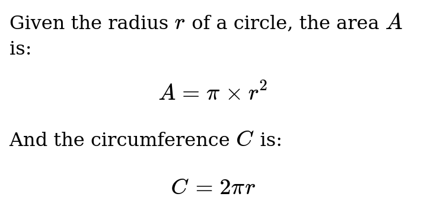

# Goldmark Katex


Goldmark Katex is a [Goldmark](https://github.com/yuin/goldmark) extension providing math and equation support through [KaTeX](https://katex.org/).

## Usage
github.com/kingreatwill/goldmark-katex/v2

``` go
goldmark.New(goldmark.WithExtensions(katex.KaTeX)).Convert(src, dst)
```

Wrap inline math with a pair of single `$`:

```markdown
$A$
```

Wrap block math with a pair of double `$`:

```markdown
$$
A = \pi \times r^2
$$
```

## Example

<table>
<tr>
<td>

```markdown
Given the radius $r$ of a circle, the area $A$ is:

$$
A = \pi \times r^2
$$

And the circumference $C$ is:

$$
C = 2 \pi r
$$
```

</td>
<td>



</td>
</tr>
</table>

```html
<!DOCTYPE html>
<!-- KaTeX requires the use of the HTML5 doctype. Without it, KaTeX may not render properly -->
<html>
  <head>
    <link rel="stylesheet" href="https://cdn.jsdelivr.net/npm/katex@0.16.11/dist/katex.min.css" integrity="sha384-nB0miv6/jRmo5UMMR1wu3Gz6NLsoTkbqJghGIsx//Rlm+ZU03BU6SQNC66uf4l5+" crossorigin="anonymous">

    <!-- The loading of KaTeX is deferred to speed up page rendering -->
    <script defer src="https://cdn.jsdelivr.net/npm/katex@0.16.11/dist/katex.min.js" integrity="sha384-7zkQWkzuo3B5mTepMUcHkMB5jZaolc2xDwL6VFqjFALcbeS9Ggm/Yr2r3Dy4lfFg" crossorigin="anonymous"></script>

    <!-- To automatically render math in text elements, include the auto-render extension: -->
    <script defer src="https://cdn.jsdelivr.net/npm/katex@0.16.11/dist/contrib/auto-render.min.js" integrity="sha384-43gviWU0YVjaDtb/GhzOouOXtZMP/7XUzwPTstBeZFe/+rCMvRwr4yROQP43s0Xk" crossorigin="anonymous"
        onload="renderMathInElement(document.body);"></script>
  </head>
  ...
</html>

```

